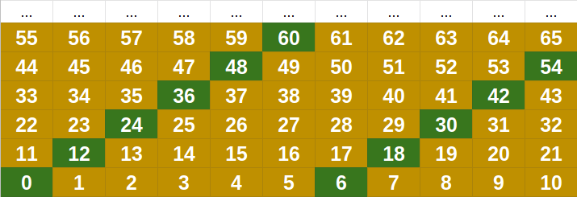
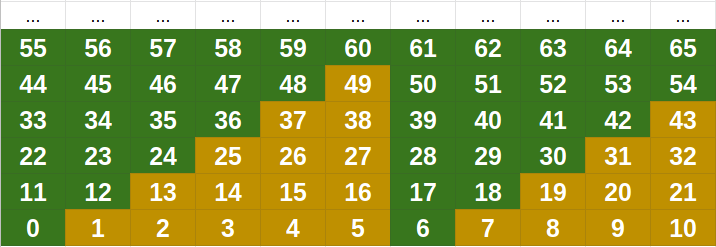

# Chicken McNugget Theorem

This markdown only serves to purpose of explain how chicken mcnugget theorem works, and to give a better explain of how to solve ["get ac in one go"](https://www.codechef.com/problems/COPR16G "link to problem") problem.

1. [Introduction](#introduction)
    - [Description of the problem](#description-of-the-problem)
    - [Example](#example)
2. [Graphic visualization](#graphic-visualization)
3. [Deduction of the formula](#deduction-of-the-formula)

## Introduction

### Description of the problem

You have the equation ax + by = c with **a** and **b** given, and the following constraints:

a ∈ Z, b ∈ Z, gcd(a, b) = 1;

x ∈ Z, x ≥ 0, y ∈ Z, y ≥ 0;

c ∈ Z;

Your task is to find the biggest **c**, that cannot be written as ax + by, for some **x** and **y**.

### Example

For example, imagine that you want to buy some McDonald's nuggets, but unfortunately they just sell in portions of 6 McNuggets or 11 McNuggets, now, imagine what is the maximum number of McNuggets that you can't buy, by just choosing packs of 6 and 11. The answer is 49, but why?

## Graphic visualization

First of all, because of the fact that gcd(a, b) = 1, we know that the first **a** multiples of **b** will not have the same modulus when divided by **a**.

See the image below for the given example when a=11 and b=6:



And also, observe that from each multiple of **b**, we can obtain every number above them, by simply adding **a**.

So, for example, from 12 we can get 23, from 23 we can get 34, and so on. The same happens to 6, from 6 we can get 17, from 17 we can get 28 and so on. See this idea being used below.



## Deduction of the formula

Observe that the number below the last of the first **a** multiples of **b** seems to be our answer, so, since the last multiple of **b** will ever be (a-1)*b, just remove **a** units from that, and we will have our answer

```(a-1) * b - a```